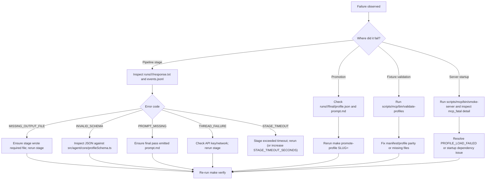

# gov-gpt Operations Runbook

## Operating Goal

Run a repeatable, fail-fast workflow that keeps `profiles/` publishable and `scripts/mcp/bin/stdio-server` startup-safe.

## Operational Flow


## Prerequisites

- Node.js 22+
- npm
- Python 3.11+
- Repo checkout with submodule available
- `.env` with `CODEX_API_KEY` for Codex passes

## Standard Procedure

### 1. Install dependencies

```bash
npm --prefix scripts/codex install --silent
npm --prefix scripts/mcp install --silent
```

### 2. Stage contracts

```bash
python scripts/stage_docs.py --version v2
```

### 3. Run pipeline

Preflight (recommended before any long run):

```bash
make codex-preflight
```

Foreground single slug:

```bash
make pipeline SLUG=v2__awards__last_updated
```

Detached full v2 run with monitoring:

```bash
make pipeline-run-bg PARALLEL=4 PIPELINE_VERSION=v2
# command prints jobDir and tail/monitor commands
```

Tune generous per-stage timeouts (prevents indefinite hangs while avoiding false positives):

```bash
# Defaults: STAGE_TIMEOUT_SECONDS=3600, STAGE_KILL_GRACE_SECONDS=20
make pipeline-run-bg PARALLEL=4 PIPELINE_VERSION=v2 STAGE_TIMEOUT_SECONDS=5400 STAGE_KILL_GRACE_SECONDS=30
```

Detached run without post-stage artifact validation (debug only):

```bash
make pipeline-run-bg PARALLEL=4 PIPELINE_VERSION=v2 SKIP_OUTPUT_VALIDATION=1
```

All staged slugs:

```bash
make pipeline-all
```

Live monitor for a background job:

```bash
make pipeline-status-watch JOB_DIR=/absolute/path/to/runs/_jobs/<job-id>
```

Replay only failed slugs from a previous job:

```bash
make pipeline-retry-failed FROM_JOB_DIR=/absolute/path/to/runs/_jobs/<job-id>
```

Coverage proof at any time:

```bash
make pipeline-coverage PIPELINE_VERSION=v2
```

Offline audit of completed outputs for a job:

```bash
make pipeline-audit JOB_DIR=/absolute/path/to/runs/_jobs/<job-id>
```

### 4. Promote profile fixtures

Single slug:

```bash
make promote-profile SLUG=v2__awards__last_updated
```

### 5. Validation and smoke

```bash
scripts/mcp/bin/validate-profiles
scripts/mcp/bin/smoke-server
```

### 6. Full verification gate

```bash
make verify
```

## Startup Procedure (MCP)

```bash
scripts/mcp/bin/stdio-server
```

Expected stderr events:

- `mcp_startup`
- `mcp_listening`

Fatal startup emits:

- `mcp_fatal`

## Troubleshooting Flow



## Failure Catalog

### `PROFILE_LOAD_FAILED`

Meaning:

- Invalid fixture schema.
- Missing `prompt.md`.
- Duplicate/invalid slug.
- No profiles found.

Actions:

1. Run `scripts/mcp/bin/validate-profiles`.
2. Fix bad fixture under `profiles/<slug>/`.
3. Re-run `scripts/mcp/bin/smoke-server`.

### `MISSING_OUTPUT_FILE`

Meaning:

- A pipeline stage did not write required output (`summary.json` or `profile.json`).

Actions:

1. Inspect `runs/<version>/<slug>/<stage>/response.txt`.
2. Inspect `runs/<version>/<slug>/<stage>/events.jsonl` if present.
3. Re-run stage (`make discover|validate|profile SLUG=<slug>`).

### `INVALID_SCHEMA`

Meaning:

- Stage output exists but does not satisfy strict schema.

Actions:

1. Compare output with `src/agent/core/profileSchema.ts`.
2. Fix prompt/logic causing schema drift.
3. Re-run failing stage.

### `PROMPT_MISSING`

Meaning:

- Final pass produced `profile.json` without `prompt.md`.

Actions:

1. Inspect `runs/<version>/<slug>/final/response.txt` for markdown extraction issues.
2. Re-run `make profile SLUG=<slug>`.

### `THREAD_FAILURE`

Meaning:

- Codex thread execution or retry loop failed.

Actions:

1. Verify `CODEX_API_KEY` is present.
2. Verify outbound network availability.
3. Re-run stage.

### `STAGE_TIMEOUT`

Meaning:

- A stage attempt exceeded the configured wall-clock timeout and was terminated.

Actions:

1. Inspect the per-slug job log under `runs/_jobs/<job-id>/logs/<slug>.log`.
2. Re-run the slug (timeouts are retryable up to `STAGE_MAX_ATTEMPTS`).
3. If the stage is legitimately slow, increase `STAGE_TIMEOUT_SECONDS` (default 3600).

## Guardrails You Should Not Bypass

- Strict schema checks at every stage.
- Strict tool input validation (`additionalProperties: false`).
- Host allowlist for outbound endpoint calls.
- Timeout enforcement for all endpoint execution.
- Fail-fast MCP startup behavior.

## Release Checklist

1. `make verify` passes locally.
2. Changes merged to `main`.
3. CI workflow succeeds.
4. Release workflow uploads profile bundle artifact.

## Useful Utility Commands

- Print staged slugs:

```bash
python scripts/list_staged_slugs.py
```

- Merge artifacts from worktrees:

```bash
make gather-runs
```

- Print MCP client config snippets:

```bash
scripts/mcp/bin/print-client-configs
```
