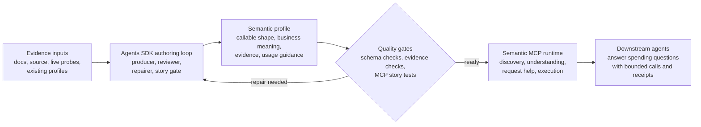

# gov-gpt

`gov-gpt` is an evidence-backed semantic MCP for the USAspending API.

The project is not trying to make a bigger REST wrapper. It is trying to give a
coding or analysis agent the context it needs to work with USAspending
correctly: discover the right endpoint, understand the business meaning, build a
valid request, inspect the evidence, and make bounded live calls.

## The Problem

USAspending is not hard because it lacks endpoints. It is hard because the API
surface mixes transport details with federal spending concepts:

- similar endpoints answer different analytical questions
- filters are nested, stateful, and easy to misuse
- documentation can be incomplete, stale, or contradicted by live behavior
- response fields often need business interpretation before they are useful
- export, pagination, geography, time, award, and account concepts have hidden
  workflow rules

A thin MCP wrapper can expose the API, but it cannot tell an agent what the API
means. `gov-gpt` is the semantic layer between those raw endpoints and the
agent trying to reason about them.

## Functional Architecture

## How It Works

1. Evidence is gathered from documentation, source behavior, existing endpoint
   profiles, and live USAspending probes. No single source is treated as
   complete or automatically correct.
2. The Agents SDK drives the authoring loop. A producer agent investigates an
   endpoint, reconciles contradictions, probes live behavior, and writes the
   semantic profile. Reviewer and repair agents challenge the result from the
   perspective of evidence quality and downstream MCP usability.
3. The semantic profile captures both the callable API shape and the analytical
   meaning: what the endpoint is for, what question it can answer, what the
   request fields mean, what the response measures represent, what caveats
   matter, and what evidence backs those claims.
4. Generic gates check the profile without hard-coding endpoint-specific
   answers. The gates validate structure, evidence links, request behavior, and
   whether another agent can use the MCP surface to complete a realistic story.
5. Once the profile is ready, the MCP runtime exposes it as a semantic interface:
   search for the right capability, inspect meaning and evidence, construct and
   validate requests, and make bounded live calls.

The Agents SDK is the production loop, not the product. The product is the
validated semantic knowledge that the MCP can serve to another agent.

## What The MCP Gives An Agent

The final MCP experience should let a downstream agent move through a spending
question in a grounded way:

- discover the endpoint or workflow that matches the user's intent
- understand the endpoint's business purpose and analytical grain
- see which request fields are required, optional, risky, or poorly supported
- distinguish documented facts from observed facts and known contradictions
- build a valid request before calling the live API
- inspect evidence for material claims
- execute bounded calls and interpret the response in context

That is the core difference from a generated client. A generated client says
"this field exists." The semantic MCP should say "this field exists, here is
what it means, here is when to use it, here is the evidence, and here is the
caveat that will matter when you answer the question."

## What A Semantic Profile Captures

Each endpoint profile is expected to preserve the information another agent
would need to use the endpoint responsibly:

- the callable request and response shape
- the business purpose of the endpoint
- the grain of analysis, such as award, transaction, geography, agency, account,
  time period, or export job
- important measures, dimensions, filters, sort behavior, pagination, joins, and
  workflow boundaries
- live availability and known failure modes
- contradictions between docs, source, existing profiles, and live behavior
- evidence and confidence status for important claims
- practical guidance for when the endpoint is suitable or unsuitable

Uncertainty is part of the profile. The system should preserve facts as
documented, observed, contradicted, unavailable, inferred, or unknown instead of
dropping anything that was not fully proven in one run.

## Boundaries

The model owns endpoint understanding. It should investigate, reconcile, and
explain what the endpoint means.

Deterministic code owns the contract. It should validate structure, check
evidence, enforce request safety, load the MCP surface, and fail loudly when the
profile is not good enough.

Raw endpoint profiles remain useful as low-level execution context, but the
semantic profile is the durable knowledge layer. The orchestration framework can
change; the evidence-backed semantic contract is what needs to survive.

## Design Principles

- Build for agent use, not just API coverage.
- Treat evidence as part of the product.
- Preserve uncertainty instead of hiding it.
- Keep endpoint-specific meaning out of validators and runtime shortcuts.
- Make the MCP useful for real spending questions, not just successful test
  calls.
- Prefer explicit gaps and contradictions over false simplicity.
