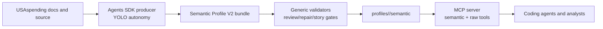

# gov-gpt

`gov-gpt` builds an evidence-backed semantic MCP for the USAspending API.

The product is not a thin HTTP wrapper. The goal is a tool surface that lets a
coding or analysis agent discover the right USAspending endpoint, understand the
business meaning of its inputs and outputs, construct valid requests, inspect
evidence, and make bounded live calls.

## Direction

The primary workflow is agentic:

- Agents SDK producers in `scripts/agents` author Semantic Profile V2 bundles.
- The model owns endpoint investigation, reconciliation, and semantic synthesis.
- Local code supplies tools, broad YOLO shell access, artifact writes, generic
  validators, MCP smoke tests, and promotion.
- Deterministic code is allowed as a gate. It should not be the author of
  endpoint-specific semantics.

The durable artifact is a four-file semantic bundle:

```text
profiles/<slug>/semantic/
  endpoint.json
  semantics.json
  evidence.jsonl
  usage.md
```

These bundles are loaded by the MCP server and exposed through semantic
discovery, understanding, request-construction, validation, and execution tools.



## Quick Start

Prerequisites:

- Node.js 22+
- npm
- Python 3.11+
- `OPENAI_API_KEY` or `CODEX_API_KEY` in `.env`

Install dependencies:

```bash
npm --prefix scripts/agents install --silent
npm --prefix scripts/codex install --silent
npm --prefix scripts/mcp install --silent
```

Run one endpoint through the semantic producer:

```bash
make agents-semantic \
  SLUG=v2__search__spending_by_geography \
  AGENTS_OUT_ROOT=runs/agents-sdk-demo \
  AGENTS_AUTONOMY=yolo
```

Validate the generated bundle:

```bash
make semantic-validate SEMANTIC_ROOT=runs/agents-sdk-demo
```

Review, repair, and story-test when a bundle is important enough to promote:

```bash
make agents-review \
  SLUG=v2__search__spending_by_geography \
  AGENTS_OUT_ROOT=runs/agents-sdk-demo \
  > runs/review.json

make agents-repair \
  SLUG=v2__search__spending_by_geography \
  AGENTS_OUT_ROOT=runs/agents-sdk-demo \
  AGENTS_REVIEW_REPORT=runs/review.json \
  AGENTS_REPAIR_TASK_ID=<task-id>

make agents-story \
  AGENTS_BUNDLE_GLOB="/Users/saulrichardson/projects/gov-gpt/runs/agents-sdk-demo/*/endpoint.json" \
  AGENTS_STORY_OUTPUT=runs/story.json
```

Promote semantic bundles into the MCP-loaded profile directories only after the
bundle passes the generic gates. Then validate and smoke-test the server:

```bash
scripts/mcp/bin/validate-semantic-bundles
scripts/mcp/bin/smoke-client
scripts/mcp/bin/stdio-server
```

## Runtime MCP

The MCP server in `scripts/mcp` exposes:

- semantic discovery tools such as `usaspending.findConcepts`,
  `usaspending.findEndpoints`, and `usaspending.findWorkflows`
- semantic inspection tools such as `usaspending.getEndpointSchema`,
  `usaspending.getEndpointSemantics`, `usaspending.getEvidence`, and
  `usaspending.getUsageGuide`
- request helpers such as `usaspending.getRequestTemplate`,
  `usaspending.validateRequest`, `usaspending.explainValidationError`, and
  `usaspending.listRequestFields`
- execution through `usaspending.callEndpoint`
- raw endpoint aliases like `usaspending.v2__search__spending_by_award`

Client config snippets:

```bash
scripts/mcp/bin/print-client-configs
```

## Supporting Raw-Profile Pipeline

The older `scripts/codex` pipeline still supports raw endpoint profile
generation through `discover`, `validate`, and `reconcile`. It remains useful for
raw MCP coverage, staged docs, and the shared Semantic Profile V2 validator.

It is not the semantic MCP authoring path. New semantic endpoint knowledge should
be produced through `scripts/agents`.

Raw-profile flow:

```bash
python scripts/stage_docs.py --version v2
make pipeline SLUG=v2__awards__last_updated
make promote-profile SLUG=v2__awards__last_updated
scripts/mcp/bin/validate-profiles
```

## Documentation Map

- Engineering approach: `docs/engineering-approach.md`
- Target MCP shape: `docs/mcp-target-shape.md`
- Semantic Profile V2 contract: `docs/semantic-profile-v2.md`
- Agent operating model: `docs/semantic-agent-operating-model.md`
- YOLO access audit and stress test: `docs/agents-sdk-yolo-access-audit.md`
- Agents SDK runner: `scripts/agents/README.md`
- MCP runtime: `scripts/mcp/README.md`
- Raw Codex profile pipeline: `scripts/codex/README.md`
- Profile fixtures: `profiles/README.md`
- Operator runbook: `OPERATIONS.md`

## Verification

Full repo verification:

```bash
make verify
```

Focused checks used most often while working on the semantic MCP:

```bash
npm --prefix scripts/agents run typecheck
npm --prefix scripts/agents run test
npm --prefix scripts/agents run smoke
npm --prefix scripts/codex run semantic:validate -- --root runs/agents-sdk
npm --prefix scripts/mcp run typecheck
npm --prefix scripts/mcp run test
scripts/mcp/bin/validate-semantic-bundles
```
