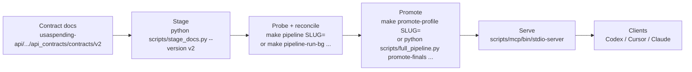

# gov-gpt

`gov-gpt` generates evidence-backed USAspending endpoint profiles and serves them as MCP tools.

## What This Is

This repository is a profile pipeline, not the USAspending API itself.

- Input: API contract markdown from the `usaspending-api` submodule.
- Processing: a 3-pass Codex pipeline per endpoint slug.
- Output: validated profile fixtures in `profiles/`.
- Runtime: an MCP stdio server exposing each profile as a tool/resource/prompt.



## Fast Start

### 1. Prerequisites

- Node.js 22+
- npm
- Python 3.11+
- `CODEX_API_KEY` in environment or `.env`

### 2. Install dependencies

```bash
npm --prefix scripts/codex install --silent
npm --prefix scripts/mcp install --silent
```

### 3. Configure environment

```bash
cp .env.example .env
# set CODEX_API_KEY
```

### 4. Stage docs and choose a slug

```bash
python scripts/stage_docs.py --version v2
python scripts/list_staged_slugs.py
```

### 5. Run one endpoint through the pipeline

```bash
make pipeline SLUG=v2__awards__last_updated
```

### 6. Promote and validate fixtures

```bash
make promote-profile SLUG=v2__awards__last_updated
scripts/mcp/bin/validate-profiles
# bulk option: promote every staged slug that already has a valid final artifact
python scripts/full_pipeline.py promote-finals --version v2 --parallel 8 --json
```

### 7. Start MCP server

```bash
scripts/mcp/bin/stdio-server
```

### 8. Connect from MCP clients

This repo ships preconfigured MCP client configs:

- `.mcp.json` (Claude Code)
- `.cursor/mcp.json` (Cursor)

For a copy-paste config snippet for other clients (including Codex Desktop), run:

```bash
scripts/mcp/bin/print-client-configs
```

## Daily Commands

```bash
# one stage
make discover SLUG=<slug>
make validate SLUG=<slug>
make profile SLUG=<slug>

# all staged slugs
make discover-all PARALLEL=2
make validate-all PARALLEL=2
make profile-all PARALLEL=2
make pipeline-promote-finals PIPELINE_VERSION=v2 PARALLEL=8

# full gate
make verify
```

## Prove Full Coverage (Background)

Run a Codex preflight first (auth + model smoke), then start a detached full-contract job:

```bash
make codex-preflight
make pipeline-run-bg PARALLEL=4 PIPELINE_VERSION=v2
```

The background command prints a `jobDir`. Use it to monitor progress:

```bash
make pipeline-status-watch JOB_DIR=/absolute/path/to/runs/_jobs/<job-id>
tail -f /absolute/path/to/runs/_jobs/<job-id>/runner.log
```

Stage output validation (schema + freshness) is enabled by default. To bypass it temporarily:

```bash
make pipeline-run-bg PARALLEL=4 PIPELINE_VERSION=v2 SKIP_OUTPUT_VALIDATION=1
```

At any point, compute proof-of-coverage:

```bash
make pipeline-coverage PIPELINE_VERSION=v2
# aggressively expand promoted coverage from already-valid finals
make pipeline-promote-finals PIPELINE_VERSION=v2 PARALLEL=8
```

Replay only failed slugs from a previous job and run an offline audit:

```bash
make pipeline-retry-failed FROM_JOB_DIR=/absolute/path/to/runs/_jobs/<job-id>
make pipeline-audit JOB_DIR=/absolute/path/to/runs/_jobs/<job-id>
```

## Documentation Map

- Deep architecture and internals: `docs/architecture.md`
- Operator runbook and remediation: `OPERATIONS.md`

## Current Snapshot

- Staged v2 contracts in `staging/docs/v2/index.jsonl`: 172 contracts, 1 supporting doc.
- Final artifacts in `runs/v2/*/final`: 83 slugs.
- Promoted profile fixtures in `profiles/manifest.json`: 86 slugs.
