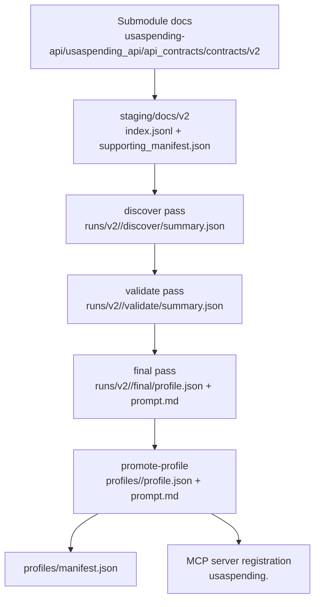

# gov-gpt Architecture

## Purpose

`gov-gpt` converts USAspending endpoint markdown into validated, runtime-safe MCP tools.

System goals:

- Preserve evidence from probing as first-class artifacts.
- Fail fast on schema drift or missing outputs.
- Expose a strict, deterministic MCP interface for downstream agents.

## End-to-End Dataflow

## Component Boundaries

- `usaspending-api/`
  - Submodule source for contract markdown only.
- `scripts/stage_docs.py`
  - Copies versioned docs into `staging/docs/<version>/`.
  - Emits `index.jsonl` with canonical slug per contract.
  - Emits `supporting_manifest.json` for always-include supporting docs.
- `scripts/codex/`
  - Pipeline runner scripts invoked through `run-agent.sh`.
  - Stages:
    - `discover.ts`: initial probe and hypothesis summary.
    - `validate.ts`: second pass stress-check and deltas.
    - `reconcile.ts`: final profile + semantic prompt synthesis.
- `src/agent/core/`
  - Shared configuration loading, schema contracts, path helpers, staging index resolution.
- `scripts/mcp/`
  - Profile loading, validation, promotion, and MCP stdio server runtime.

## Canonical Identifiers and Paths

Slug format is strict and version-prefixed.

- Format: `v<version>__<path_parts_joined_by__>`
- Example: `v2__awards__last_updated`

Path conventions:

- Staging: `staging/docs/<version>/...`
- Run artifacts: `runs/<version>/<slug>/{discover,validate,final}/...`
- Published fixtures: `profiles/<slug>/{profile.json,prompt.md}`
- Fixture manifest: `profiles/manifest.json`

## Stage Contracts

Schemas are defined in `src/agent/core/profileSchema.ts` and re-exported via `src/agent/core/schema.ts`.

- `DiscoverSchema`
  - Requires `schemaVersion`, `contract`, `probes`, `mismatches`, `gaps`, `risks`.
- `ValidateSchema`
  - `DiscoverSchema` plus `deltas`.
  - Super-refine requires at least one probe where `meta.newFromPass2 === true`.
- `ProfileSchema`
  - Final contract requires:
    - `contract.confidence = "confirmed"`
    - `contract.lifecycle`
    - `contract.lastVerified` in `YYYY-MM-DD`

If a stage emits missing/invalid output, `ensureValid()` attempts a constrained repair and fails with explicit error code if unresolved.

## Per-Stage Runtime

### Discover (`scripts/codex/src/discover.ts`)

- Resolves slug from staged index.
- Loads endpoint markdown + supporting docs.
- Starts Codex thread and writes:
  - `prompt.txt`
  - `response.txt`
  - `items.jsonl` and `usage.json` when present
  - `events.jsonl` for thread events
  - `summary.json` (required)

### Validate (`scripts/codex/src/validate.ts`)

- Requires discover output at `runs/<version>/<slug>/discover/summary.json`.
- Replays pass-1 context into pass-2 prompt.
- Writes `runs/<version>/<slug>/validate/summary.json` and sibling artifacts.

### Final/Reconcile (`scripts/codex/src/reconcile.ts`)

- Requires discover + validate summaries.
- Merges evidence into canonical final outputs:
  - `runs/<version>/<slug>/final/profile.json`
  - `runs/<version>/<slug>/final/prompt.md`
- Enforces strict presence of `prompt.md` (`PROMPT_MISSING` on failure).

## Promotion and Fixture Integrity

`promote-profile` (`scripts/mcp/src/promoteProfile.ts`):

- Source: `runs/<version>/<slug>/final/{profile.json,prompt.md}`
- Destination: `profiles/<slug>/...`
- Updates `profiles/manifest.json` with:
  - `slug`
  - `lastVerified`
  - `profilePath`
  - `promptPath`

`validate-profiles` (`scripts/mcp/src/validateProfiles.ts`) checks:

- Manifest schema and canonical schema version.
- Manifest/profile slug parity.
- Existence of every declared profile + prompt path.

## MCP Runtime Model

Server entrypoint: `scripts/mcp/src/server.ts`

Startup sequence:

1. `loadProfiles()` parses all fixtures and enforces invariants.
2. Fail-fast if load errors (`PROFILE_LOAD_FAILED`) or zero profiles.
3. Register runtime surface:
   - Utility tools:
     - `usaspending.findEndpoints`
     - `usaspending.getEndpoint`
   - Endpoint tools:
     - `usaspending.<slug>` for each loaded profile
   - Resources:
     - `usaspending://profiles/all`
     - `usaspending://profiles/<slug>`
     - `usaspending://prompts/<slug>`
   - Prompt:
     - `usaspending.endpointUsage`
4. Emit structured startup/listening logs to stderr.

## Call Safety and Guardrails

Execution path: `scripts/mcp/src/call.ts`

Guardrails:

- Input validation through AJV with `additionalProperties: false`.
- Tool input schema generation from profile definitions via Zod.
- Host allowlist (default `https://api.usaspending.gov`).
- Timeout enforcement (`USASPENDING_REQUEST_TIMEOUT_MS`, default `15000`).
- Deterministic User-Agent (`gov-gpt-mcp/1.0.0` default).

Failure modes are explicit (`HOST_NOT_ALLOWED`, `REQUEST_TIMEOUT`, validation failures).

## CI and Release

- CI (`.github/workflows/ci.yml`)
  - Runs `make verify`:
    - Typecheck and tests in `scripts/codex` and `scripts/mcp`
    - Fixture validation
    - Startup smoke check
- Release (`.github/workflows/release.yml`)
  - Triggered by successful CI workflow run.
  - Uploads `profiles-<sha>.tgz` artifact.

## Extension Points

### Add or refresh a profile slug

1. `python scripts/stage_docs.py --version v2`
2. `make codex-preflight`
3. `make pipeline SLUG=<new_slug>`
4. `make promote-profile SLUG=<new_slug>`
5. `scripts/mcp/bin/validate-profiles`
6. `scripts/mcp/bin/smoke-server`

### Prove full-contract coverage in background

1. `make codex-preflight`
2. `make pipeline-run-bg PARALLEL=4 PIPELINE_VERSION=v2`
3. `make pipeline-status-watch JOB_DIR=/absolute/path/to/runs/_jobs/<job-id>`
4. `make pipeline-coverage PIPELINE_VERSION=v2`

### Add stricter constraints

- Update `src/agent/core/profileSchema.ts` (canonical schema).
- Keep `scripts/mcp/src/types.ts` and loaders aligned.
- Run `make verify` before publishing.
