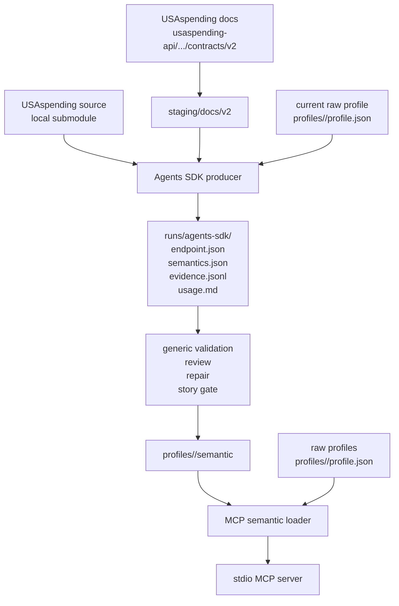
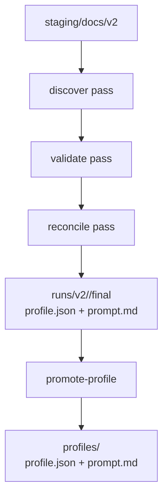

# gov-gpt Architecture

## Purpose

`gov-gpt` converts scattered USAspending documentation, source behavior, live API
observations, and agent-authored semantic analysis into an MCP surface that a
coding agent can use reliably.

System goals:

- Keep evidence as first-class artifacts.
- Let a general coding agent author endpoint semantics with broad autonomy.
- Use deterministic code for validation, loading, guardrails, and repeatable MCP
  execution, not for endpoint-specific semantic synthesis.
- Expose both semantic helpers and raw endpoint calls through MCP.
- Fail loudly on invalid artifacts, schema drift, missing evidence, or unsafe
  requests.

## Primary Dataflow



The semantic bundle is the source of truth for the higher-level MCP behavior.
The framework that produced it is replaceable; the bundle contract and gates are
not.

## Component Boundaries

- `scripts/agents/`
  - Primary Semantic Profile V2 producer, reviewer, repairer, and story-gate
    implementation using the OpenAI Agents SDK.
  - Default autonomy is `yolo`, which grants each role shell access through
    `yolo_shell_command`.
  - The TypeScript code supplies tools and gates. The model owns endpoint
    understanding and artifact content.
- `src/agent/core/semanticProfileSchema.ts`
  - Canonical Semantic Profile V2 schema used by validators and loaders.
- `scripts/mcp/`
  - MCP runtime, semantic bundle loading, request helpers, validation, raw calls,
    smoke clients, and promotion utilities.
- `scripts/codex/`
  - Supporting raw-profile pipeline: `discover`, `validate`, `reconcile`.
  - Also owns the shared `semantic:validate` command for run-root validation.
  - It is not the semantic authoring path.
- `profiles/`
  - Published raw profile fixtures and promoted semantic bundles.
- `usaspending-api/`
  - Local source and contract-doc submodule used as evidence.

## Semantic Bundle Contract

Each promoted semantic endpoint contains:

```text
profiles/<slug>/semantic/
  endpoint.json
  semantics.json
  evidence.jsonl
  usage.md
```

`endpoint.json` captures the callable surface, availability, request facts,
response facts, request templates, MCP coverage gaps, contradictions, quirks,
gaps, and risks.

`semantics.json` captures business purpose, analytical grain, entities,
measures, dimensions, suitable questions, unsuitable questions, joins,
workflows, and caveats.

`evidence.jsonl` backs every material claim.

`usage.md` is a derived guide for a downstream agent using the MCP.

## Agent Runtime

The producer receives an endpoint slug and a final artifact contract. It can:

- load staged docs and current raw/semantic profiles
- read repository files
- search source and tests
- run bounded USAspending probes through narrow tools
- run arbitrary shell commands in YOLO mode
- write the four required artifacts
- validate and promote only after validation succeeds

Reviewer, repairer, and story agents use the same contract from different
angles:

- reviewer checks semantic richness, evidence, contradictions, and MCP value
- repairer fixes selected findings without weakening gates
- story agent uses the MCP like a downstream coding agent and reports whether it
  can answer an interesting query

## Validation Gates

Run-root validation:

```bash
npm --prefix scripts/codex run semantic:validate -- --root runs/agents-sdk
```

Promoted semantic bundle validation:

```bash
scripts/mcp/bin/validate-semantic-bundles
```

MCP smoke client:

```bash
scripts/mcp/bin/smoke-client
```

These checks enforce generic contracts:

- required files exist
- JSON artifacts match schema
- every evidence reference resolves
- observed or contradicted facts cite evidence
- available endpoints cite at least one live probe
- important missing MCP fields are still represented as request facts
- `usage.md` does not leak prompt/process narration or contradict availability
- promoted bundles load through the MCP runtime

## MCP Runtime Model

Server entrypoint: `scripts/mcp/src/server.ts`

Startup sequence:

1. Load raw profiles from `profiles/<slug>/profile.json`.
2. Load semantic bundles from `profiles/<slug>/semantic/`.
3. Fail fast if raw profile loading fails or no profiles are available.
4. Register semantic discovery, understanding, request construction, and
   execution tools.
5. Register raw endpoint aliases for promoted raw profiles.
6. Start stdio transport.

Semantic tools include:

- `usaspending.findConcepts`
- `usaspending.findEndpoints`
- `usaspending.findWorkflows`
- `usaspending.getEndpointSchema`
- `usaspending.getEndpointSemantics`
- `usaspending.getEvidence`
- `usaspending.getUsageGuide`
- `usaspending.getRequestTemplate`
- `usaspending.validateRequest`
- `usaspending.explainValidationError`
- `usaspending.listRequestFields`
- `usaspending.callEndpoint`

Raw aliases like `usaspending.v2__search__spending_by_award` remain available
for direct calls once a downstream agent understands the endpoint.

## Raw-Profile Pipeline

The raw pipeline still exists because it provides useful low-level coverage:



It is intentionally separate from Semantic Profile V2. Raw profiles are execution
fixtures and prior art for the agent. Semantic bundles are the higher-level MCP
knowledge surface.

## Extension Points

Add or refresh one semantic endpoint:

```bash
make agents-semantic SLUG=<slug> AGENTS_OUT_ROOT=runs/agents-sdk
make semantic-validate SEMANTIC_ROOT=runs/agents-sdk
make agents-review SLUG=<slug> AGENTS_OUT_ROOT=runs/agents-sdk > runs/review.json
make agents-story AGENTS_BUNDLE_GLOB="/abs/path/to/runs/agents-sdk/*/endpoint.json"
```

Promote after validation and review:

```bash
npm --prefix scripts/agents run semantic:agent -- \
  --slug <slug> \
  --out-root runs/agents-sdk \
  --promote
scripts/mcp/bin/validate-semantic-bundles
scripts/mcp/bin/smoke-client
```

Add stricter semantic constraints:

- update `src/agent/core/semanticProfileSchema.ts`
- update validators or MCP loaders that consume the affected fields
- add targeted tests in `scripts/codex`, `scripts/agents`, or `scripts/mcp`
- rerun package typechecks and tests before promotion
